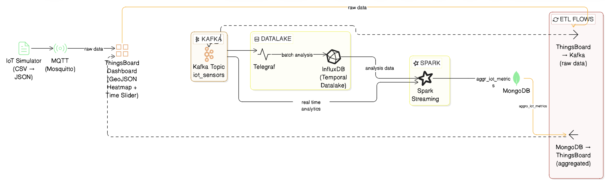

# TBDM-Heatmap
**Project for the exam of Technologies for Big Data Management, held by professor Massimo Callisto De Donato - University of Camerino, Italy.**

This project implements a complete IoT data processing pipeline. It simulates sensor data ingestion into **ThingsBoard**, processes telemetry through a Big Data stack (**Kafka, Spark, InfluxDB, MongoDB**), and closes the loop by sending aggregated analytics back to the dashboard.

---

## Architecture & Data Flow



The architecture implements a circular data lifecycle designed to bridge the gap between raw IoT telemetry and actionable Big Data insights. Unlike traditional linear pipelines, this system treats ThingsBoard as a central "IoT Control Plane," serving as both the primary ingress point and the final destination for processed intelligence.
Key architectural pillars include:
1. **Decoupled Ingestion**: A flexible ingress layer that adapts to different networking constraints through interchangeable push/pull strategies.
2. **Dual-Path Analytics**: A specialized infrastructure that separates long-term cold storage (Datalake) from sub-second real-time processing (Spark Streaming).
3. **Operational Feedback Loop**: A closed-loop mechanism that re-injects analytical results into the original monitoring interface, enabling data-driven decision-making directly on the dashboard.

The system supports two ingestion strategies via Docker profiles:

1.  **Polling Profile**: An ETL process polls ThingsBoard every **5 seconds**. It uses a **Watermark** (storing the last timestamp per device) to ensure data consistency and avoid duplicates.
2.  **Rule-Chain Profile**: ThingsBoard uses a custom Rule Chain to push data directly to a **FastAPI** endpoint. This endpoint transforms the data and forwards it to Kafka.

### The Pipeline:
* **Simulation**: [Data](https://www.kaggle.com/datasets/ranakrc/smart-building-system) is read from a dataset and sent to ThingsBoard.
* **Ingestion**: Data is captured by the chosen profile (ETL Polling or Rule-Chain/FastAPI) and converted into the Kafka payload.
* **Persistence (Raw)**: Raw data is persisted into **InfluxDB**.
* **Stream Processing**: **Apache Spark** listens to the `iot_sensors` Kafka topic, performing windowed aggregations (**Avg, Min, Max, StdDev, Variance**, etc.) per device.
* **Persistence (Aggregated)**: Results are stored in **MongoDB**.
* **Closing the Loop**: A secondary ETL polls MongoDB and updates ThingsBoard with the calculated aggregations.

---

## Installation & Setup

### 1. Start Docker Containers
First, start the influxdb container:

> docker compose up -d influxdb

and then execute this command in the terminal `docker exec -it influxdb influx auth list`. Copy the token in the environment variable "INFLUX_ADMIN_TOKEN"

Choose **one** of the following profiles to start the stack:

**For Polling-based extraction:**
> docker compose --profile polling up -d --build

**For Rule-Chain based extraction:**
> docker compose --profile rulechain up -d --build

**IMPORTANT - If using the Rule-Chain profile:**
1. Open ThingsBoard UI.
2. Import the `root_rule_chain.json` file into the Rule Chains section.
3. Set it as the **Root Rule Chain**.


### 2. Initialize Data
After the containers are up and running, execute these scripts in order to set up the environment:

1.  **Generate Mapping**: Create the building/sensor map from the dataset.
    > python mapping_geojson_initializer.py
2.  **Provision Devices**: Map the devices from the generated file to ThingsBoard.
    > python map_devices_to_thingsboard.py
3. **Load Initial Data**: Project the first hour of sensor data to ThingsBoard.
    >    python initialize_data_on_thingsboard.py

*Note: To avoid overwhelming the memory  only the first hour of data for each device is sent during initialization.*

---

## Historical Analysis & Batch Processing

While the streaming pipeline handles real-time alerts, the system includes a **Batch Processing layer** designed for deep temporal analysis. This layer queries the raw data stored in **InfluxDB** to generate high-level reports, such as daily comfort evaluations and sensor health checks.

### 1. Manual Execution

You can manually trigger the batch analysis job by submitting the Spark job to the master container. This is useful for on-demand reporting or re-processing historical data.

For the daily comfort report, execute the following command:

```bash
docker exec -it spark-master /opt/bitnami/spark/bin/spark-submit \
  --master spark://spark-master:7077 \
  /app/batch/dialy_report.py
```

For the weekly sensor health check, use:

```bash
 docker compose run --rm spark-batch \
  /opt/spark/bin/spark-submit \
  --packages org.mongodb.spark:mongo-spark-connector_2.12:10.2.1 \
  /app/batch/weekly_health.py
```

### 2. Scheduled Execution (via Ofelia)

The project uses Ofelia, a Docker-native scheduler, to automate these jobs. By default, the batch job is configured to run during off-peak hours (e.g., every night at 02:00) to minimize system load.
The configuration is managed directly in the docker-compose.yml labels for the Spark container.

### 3. Output Data Structure

The results of the batch processing are persisted in a dedicated collection in MongoDB. This data represents the "Serving Layer" for historical dashboards. Below is an example of a Daily Comfort Report document generated by the batch job:

```json
{
  "_id": "69a5e184b2e8a62bcac343a4",
  "report_date": "2013-08-24T00:00:00.000Z",
  "building": "POLOA",
  "floor": "4",
  "room": "417",
  "avg_temp": 23.71203354297698,
  "avg_co2": 410.3312368972746,
  "comfort_status": "GOOD"
}
```
***Note on comfort_status***: This field is calculated using a custom Spark logic that weights temperature and CO2 levels against international comfort standards, providing an immediate KPI for facility managers.

---

## Service Endpoints &  Credentials

Once the stack is running, you can access the various services using the following local endpoints and default credentials:

| Service | Endpoint | Credentials / Details |
| :--- | :--- | :--- |
| **ThingsBoard UI** | [http://localhost:9191](http://localhost:9191) | **User**: `tenant@thingsboard.org` <br> **Pass**: `tenant` |
| **InfluxDB UI** | [http://localhost:8086](http://localhost:8086) | **User**: `poloa_admin` <br> **Pass**: `password` <br> **Org**: `POLOA_org` <br> **Bucket**: `temporal_datalake` |
| **Spark Master UI** | [http://localhost:8080](http://localhost:8080) | *No authentication required* |
| **Kafka Connect REST** | [http://localhost:8083](http://localhost:8083) | *API for connector management* |
| **MongoDB** | `mongodb://localhost:27017` | *No auth* <br> **Database**: `building_iot` <br> **Collection**: `aggr_iot_metrics` |
| **Kafka Broker** | `localhost:29092` | *External listener for local debugging* |
| **MQTT Broker** | `localhost:1883` | *Eclipse Mosquitto port* |

---

## Technical Specifications

### Data Payload
The internal data format used across the pipeline (Kafka/Spark) is as follows:
`{
    "timestamp": "timestamp_value",
    "building": "building_name",
    "floor": "floor_level",
    "room": "room_id",
    "sensor_type": "type",
    "sensor_id": 123,
    "value": 25.5
}`

### Technology Stack
* **ThingsBoard**: IoT Platform & Visualization.
* **FastAPI**: Transformation endpoint (Rule-Chain profile).
* **Apache Kafka**: Message Broker.
* **Apache Spark**: Real-time Analytics.
* **InfluxDB**: Time-series Database (Raw data).
* **MongoDB**: Document Store (Aggregated data).
* **MQTT**: Connectivity protocol.

##  Authors 

* **[Omar El Idrissi](mailto:omar.elidrissi@studenti.unicam.it)**
* **[Lorenzo Gezzi](mailto:lorenzo.gezzi@studenti.unicam.it)**
* **[Nicolas Rossi](mailto:nicolas.rossi@studenti.unicam.it)** 
